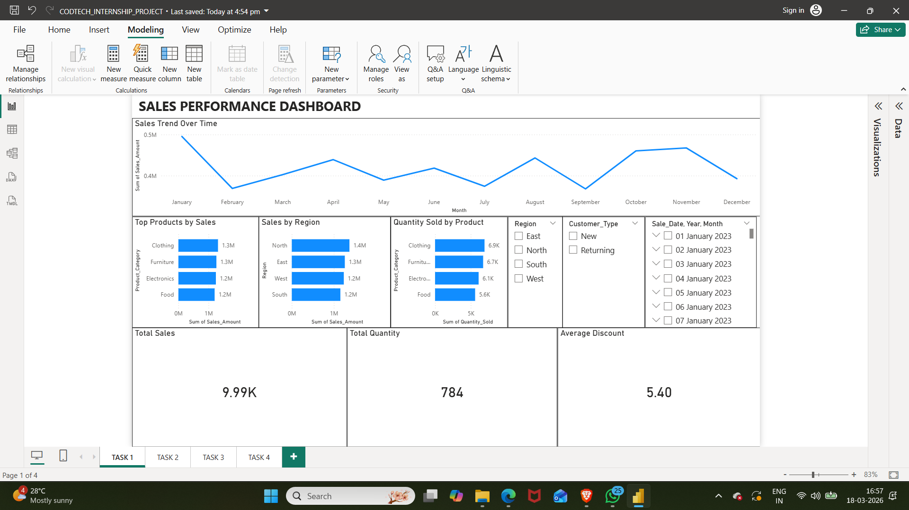
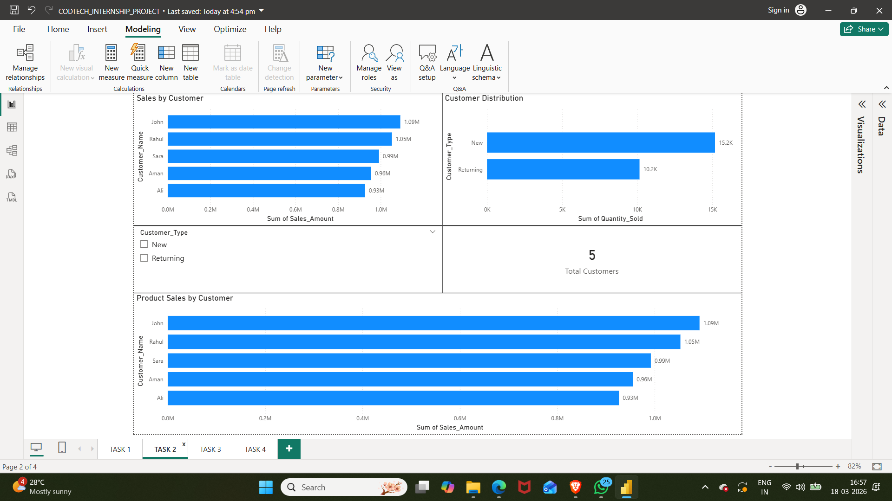
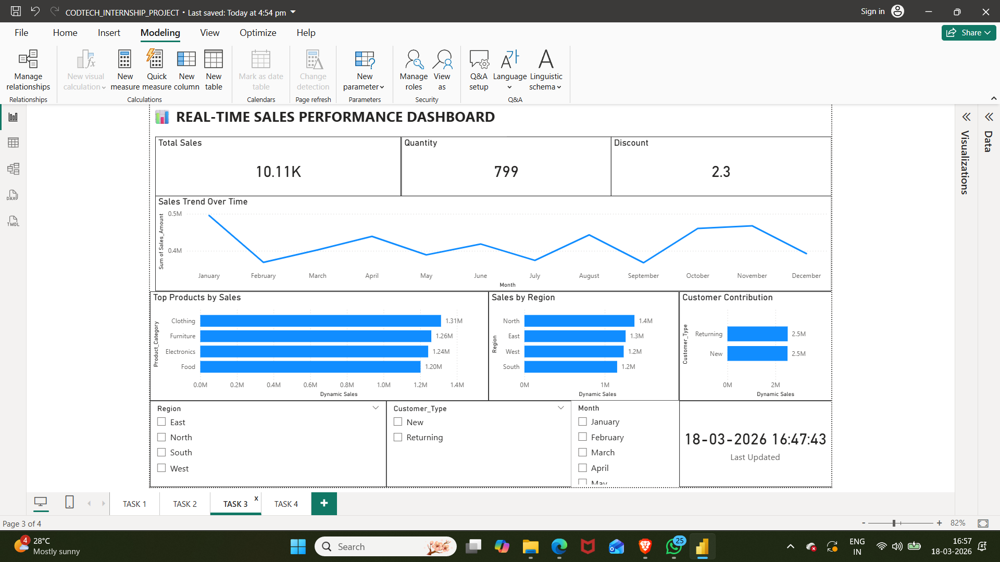
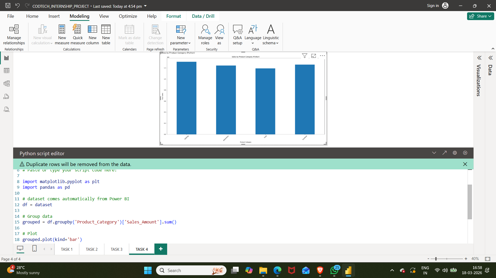

# 📊 Real-Time Sales Performance Dashboard (Power BI Internship Project)

## 🚀 Overview

This project was developed as part of my internship at **CODTECH** to demonstrate practical skills in **data analytics, visualization, and business intelligence** using Power BI.

The project covers dashboard creation, data integration, real-time simulation, and Python-based analysis.

---

## 🏢 Internship Details

* **Company:** CODTECH
* **Role:** Power BI Intern
* **Project Type:** Dashboard Development & Data Analysis

---

## 📌 Project Tasks

### 🔹 Task 1: Sales Dashboard

* Created an interactive Power BI dashboard
* Visualized:

  * Sales trends over time
  * Top products
  * Regional performance
  * Customer contribution

---

### 🔹 Task 2: Data Integration

* Combined data from multiple sources (Excel datasets)
* Established relationships using **Customer_ID**
* Built a unified data model for analysis

---

### 🔹 Task 3: Real-Time Dashboard

* Implemented dynamic measures using DAX:

  * `NOW()` for real-time updates
  * `RANDBETWEEN()` for live data simulation
* Enabled auto-refresh for dynamic dashboard updates
* Designed a real-time sales performance dashboard

---

### 🔹 Task 4: Python Integration

* Integrated Python scripts within Power BI
* Used:

  * `pandas` for data manipulation
  * `matplotlib` for visualization
* Created custom charts beyond default Power BI visuals

---

## 🛠️ Tools & Technologies

* Power BI
* DAX (Data Analysis Expressions)
* Python (pandas, matplotlib)
* Microsoft Excel

---

## 📊 Key Features

* Interactive filters (Region, Customer Type, Month)
* Real-time updating dashboard
* Multi-source data integration
* Python-based custom visualizations

---

## 📈 Insights Gained

* Clothing category generates the highest sales
* Northern region shows strong performance
* Returning customers contribute significantly to revenue

---

## 📁 Project Files

* Power BI Dashboard (`.pbix`)
* Screenshots of all tasks
* Project Report (PDF)

---

## 💡 Learning Outcomes

Through this internship project, I gained hands-on experience in:

* Data modeling and relationships
* Dashboard design and storytelling
* Real-time data simulation using DAX
* Integrating Python with Power BI

---

## 🚀 Author

**SHAIK MOHAMMAD ALI PEERULLA**
BTech 3rd Year Student
GITAM UNIVERSITY HYDERABAD

---

## ⭐ Acknowledgment

This project was completed as part of my internship at **CODTECH**, providing practical exposure to real-world Power BI dashboard development and data visualization techniques.

---

## 🔗 Connect with Me

(www.linkedin.com/in/shaik-mohammad-ali-peerulla-8522973a4)
